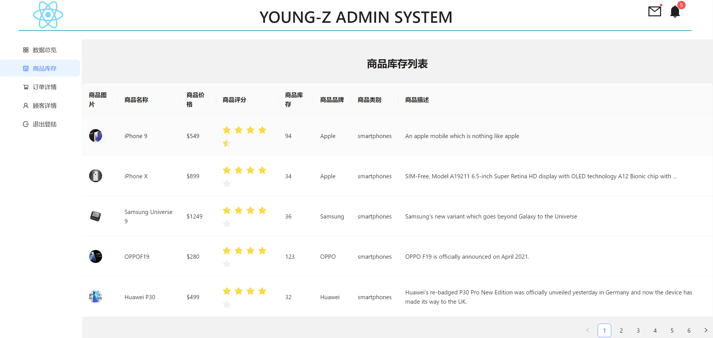

# React-Simple-Antd-Admin-System
## 技术栈
- 使用dummy json APIs模拟获取数据传到表格等组件中
- React、React-Hooks、React-router、Antd、Antv、fetch
## 预览图
**Chrome**

## 使用方法

### yarn (安装依赖)
### yarn start
Runs the app in the development mode.
Open http://localhost:3000 to view it in your browser. The page will reload when you make changes. You may also see any lint errors in the console.

### yarn test
Launches the test runner in the interactive watch mode. See the section about running tests for more information.

### yarn build
Builds the app for production to the build folder.
It correctly bundles React in production mode and optimizes the build for the best performance.
The build is minified and the filenames include the hashes.
Your app is ready to be deployed!
